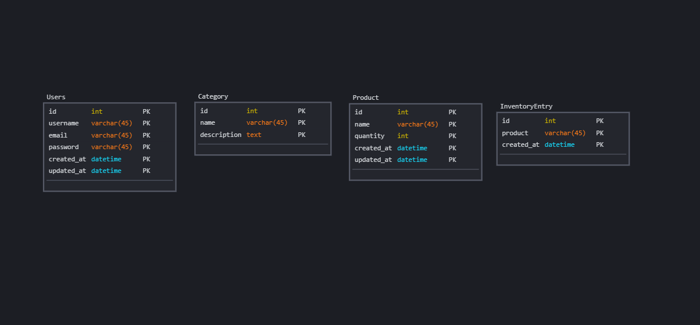
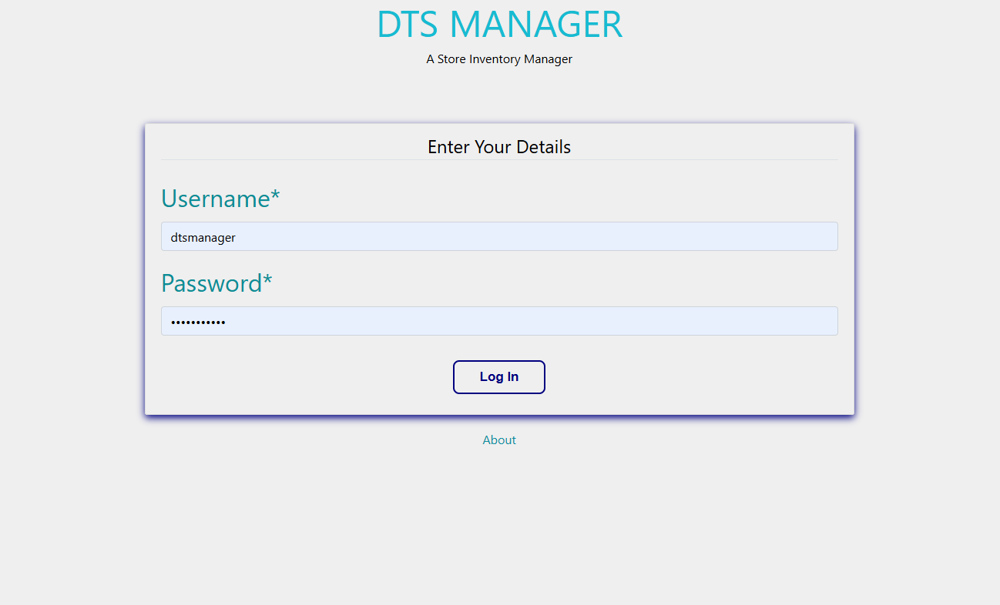
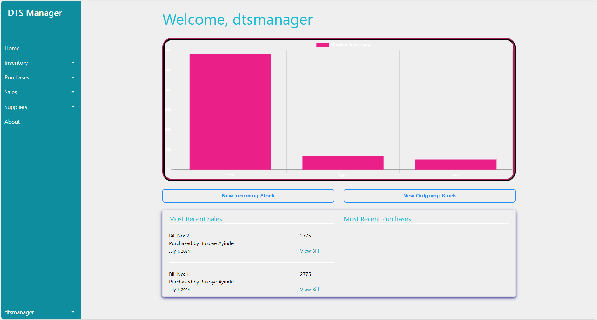
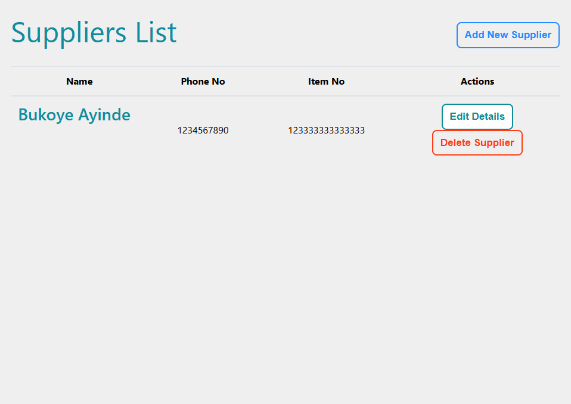

# DTS Manager | Your ultimate solution for seamless inventory management

__DTS Manager -> is an inventory management web application that helps stores effectively manage their inventory and supplier relationships.__

# Project Description:
__This Django-based web application serves as a comprehensive solution for managing store sales and purchases, and keeping records of items. The application is built upon a sqlite3 database and SQLAlchemy ORM, providing structured storage for records.__

# Key Features:

> Dual-User Interface::
* A corporate admin dashboard for managing store records and staff access.
* A user-friendly interface for store inventory management.

> Authentication and Authorization:
* Login systems for admins and staffs.
* Secure authentication mechanisms (password hashing and comparison) to protect user credentials.

> Product Management
* CRUD Operations for Products
* Category and Sub-category Management

> Inventory Management
* Track Inventory Levels
* Stock In/Stock Out

> Dashboard:
* Analytics, transactions are displayed on the dashboard.
* Features a side bar with navigation to different pages; Inventory, Purchases, Sales, Suppliers, About.

# Project Structure:
> Models:
* Defines the database models using Django's ORM to represent products, categories, orders, and inventory entries.

> Storage Engine:
* Django's ORM provides an abstraction layer to interact with the SQLite database, handling CRUD (Create, Read, Update, Delete) operations.

> API Views:
*  Implements the API endpoints using Django's class-based views and REST framework to organize the code based on functionality

> Web Pages:
* Includes Django views for handling user authentication, product management, order processing, and the home page.

> Templates:
* Contains HTML templates for rendering different pages of the application using Django's templating system.

> Static Assets:
* Includes CSS files for styling and JavaScript files for handling frontend interactions (like dynamic updates of inventory information).

# Technology Stack:
> Python:
* The programming language for the backend logic.
> Django:
* The web framework for building the application.
> SQLAlchemy:
* The ORM for database interactions.
> SQLite:
* The database system.
> HTML, CSS, JS:
* Technologies used for frontend development.

# Task Manager (Trello Board):
* https://trello.com/invite/b/AxnETonq/ATTI82aed7718ca2934b7ef087f5d492d70b4132D620/my-portfolio-project

# Data Modelling:

# Project's Screenshots

# Installation
* pip install -r requirement.txt   /to install all the necessary dependencies

* python manage.py makemigrations
  python manage.py migrate
 /To migrate model changes in the app

* python manage.py createsuperuser   /to create an admin user

* python manage.py runserver   /to run the server

# Author:
> Timothy Ofie - [Github](https://github.com/Timzblue12)
